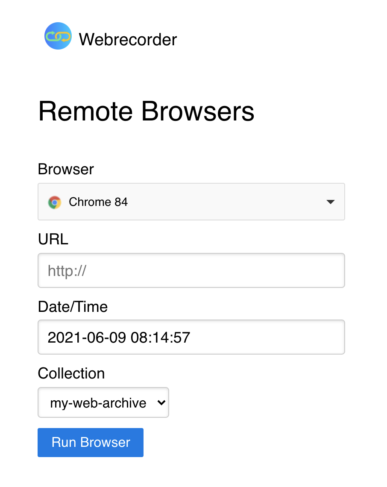

# pywb Remote Browsers

This repository provides a simple configuration for deploying any [pywb](https://github.com/webrecorder/pywb)
with remote browsers provided by [OWT/Shepherd Remote Browser System](https://github.com/oldweb-today/shepherd)

To use:

1) Clone this repo

2) Add new or existing collections to the `collections` directory, eg. by running [wb-manager](https://pywb.readthedocs.io/en/latest/manual/apps.html#wb-manager)
 or copy an [existing pywb collections directory](https://pywb.readthedocs.io/en/latest/manual/configuring.html#directory-structure) into the local collections directory.

3) Pull one or more Browser Docker Images from: https://hub.docker.com/r/oldwebtoday/chrome/tags or https://hub.docker.com/r/oldwebtoday/firefox/tags

(See below for more info).


4) Run `docker-compose up -d` to start.

4) Go to `http://localhost:9020/`

### Browsing UI

The default UI provides a set of controls for entering URL, timestamp, choosing a browser, and choosing a collection. The system will then start the selected remote browser connected to that pywb collection in an iframe.

</img>


### Viewer UI

To load the remote browser directly without the iframe or sidebar controls, you can also visit `http://localhost:9020/<browser>/<coll>/<timestamp>/<url>`.


## Getting Remote Browser Images

The Browser Images are downloaded manually, to allow users to choose which browsers they want to run.

Browsers can be obtained from the oldwebtoday browser repos including: https://hub.docker.com/r/oldwebtoday/chrome/tags and https://hub.docker.com/r/oldwebtoday/firefox/tags.

At least one browser must be downloaded for the system to work, eg. `docker pull oldwebtoday/chrome:88`.

Additional browsers will (hopefully) be added in the future!

## Adding pywb collections

pywb collections can be added while the system is running, and will be recognized on refresh, for example:

```
wb-manager init new-coll
wb-manager add new-coll some-warc-files.warc
```

The `new-coll` should now appear in the collection dropdown.


## Audio

The system is configured with audio support via WebRTC, using a turn server operating on port 33478.
This port must be accessible to if connecting remotely.

TODO Add docs on configuring over SSL via nginx proxying.

